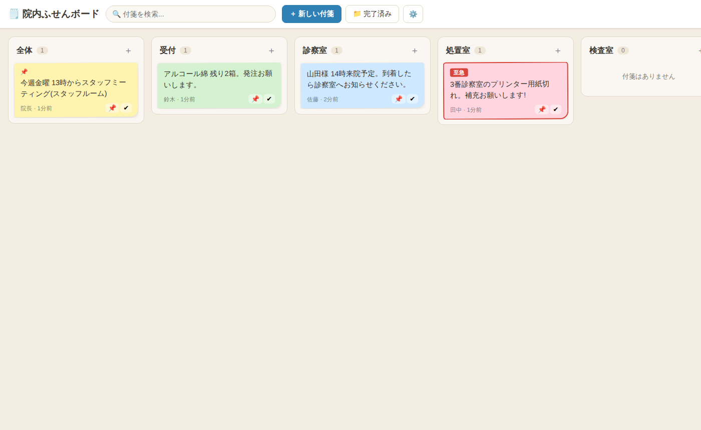

# 🗒️ 院内ふせんボード

院内ネットワーク(LAN)だけで使える、付箋型のメッセージ共有システムです。
受付・診察室・処置室など部署ごとの列に付箋を貼るように、スタッフ間の連絡を共有できます。

- **インターネット接続不要** — 院内LAN内だけで完結します(患者情報が外部に出ません)
- **インストール不要** — Python が入ったPC 1台でサーバーを起動し、各端末はブラウザで開くだけ
- **依存ライブラリなし** — Python 標準機能のみで動作。データは同フォルダの SQLite ファイルに保存

## 画面イメージ



## 主な機能

| 機能 | 説明 |
|---|---|
| 部署ごとのボード | 受付・診察室・処置室・検査室などの列に付箋を貼る(列は設定画面で自由に変更可) |
| 色分け | 黄・ピンク・青・緑・紫の5色。用途に合わせて使い分け(例: 黄=連絡、ピンク=至急、青=患者対応、緑=備品) |
| 🔴 至急フラグ | 赤枠で強調表示され、列の上位に表示されます |
| 📌 ピン留め | 大事な付箋を列の一番上に固定 |
| ✔ 完了 | 対応が終わった付箋はワンタップで「完了済み」へ。誤操作しても「戻す」で復元可能 |
| 🔍 検索 | 内容・投稿者名で絞り込み |
| 自動更新 | 5秒ごとに全端末へ自動反映。新しい付箋が届くと画面右下に通知 |

## 使い方の例

- **受付 → 診察室**: 「山田様 14時来院予定。到着したらお知らせします」
- **申し送り**: 「明日午前は佐藤Dr休診。予約患者さんへの連絡済みです」
- **至急連絡**: 「🔴 3番診察室のプリンター用紙切れ。補充お願いします」
- **備品・発注**: 「アルコール綿 残り2箱。発注お願いします」
- **全体連絡**: 「今週金曜 13時からミーティング(スタッフルーム)」

## 必要なもの

- サーバー役のPC 1台(**Python 3.8 以上**が入っていればOK。Windows / Mac / Linux いずれも可)
- 各端末(PC・タブレット・スマホ)のブラウザ(Chrome / Edge / Safari)

Python が未インストールの場合は https://www.python.org/downloads/ からインストールしてください
(Windows の場合、インストール時に「Add Python to PATH」に必ずチェックを入れてください)。

## 起動方法

### Windows の場合

`start.bat` をダブルクリックするだけです。

### Mac / Linux の場合

```bash
python3 server.py
```

起動すると、以下のように接続先URLが表示されます。

```
====================================================
  院内ふせんボード を起動しました

  このPCから:      http://localhost:8420/
  院内の他の端末から: http://192.168.1.23:8420/

  終了するには Ctrl+C を押してください
====================================================
```

各端末のブラウザで「院内の他の端末から」のURLを開き、**ブックマーク(お気に入り)に登録**しておくと便利です。

> 💡 初回アクセス時に画面が表示されない場合は、サーバーPCのファイアウォールで
> ポート 8420 (または Python) の通信を許可してください。

### ポートを変更したい場合

環境変数 `FUSEN_PORT` で変更できます。

```bash
# 例: ポート 8080 で起動
FUSEN_PORT=8080 python3 server.py
```

Windows の場合は `start.bat` をメモ帳で開き、`set FUSEN_PORT=8080` の行のコメント(rem)を外してください。

## データの保存とバックアップ

- すべてのデータは同じフォルダの **`fusen.db`** (SQLiteファイル) に保存されます
- バックアップはこのファイルをコピーするだけです(サーバー停止中のコピーを推奨)
- サーバーを再起動してもデータは消えません

## サーバーPCの起動時に自動で立ち上げる(任意)

- **Windows**: `start.bat` のショートカットを「スタートアップ」フォルダ
  (`Win + R` → `shell:startup`)に入れると、PC起動時に自動で立ち上がります
- **Mac / Linux**: launchd / systemd 等に登録してください

## 運用上の注意

- 認証機能はありません。**院内LAN内でのみ**使用し、外部(インターネット)に公開しないでください
- 付箋は院内の誰でも編集・完了・削除できます(小規模チームでの気軽な運用を想定)
- 患者情報を書く場合は、院内の情報管理ルールに従ってください

## ファイル構成

```
server.py          サーバー本体 (Python 標準ライブラリのみ)
start.bat          Windows 用起動ファイル
static/
  index.html       画面
  style.css        デザイン
  app.js           画面の動作
fusen.db           データ (初回起動時に自動作成)
```
